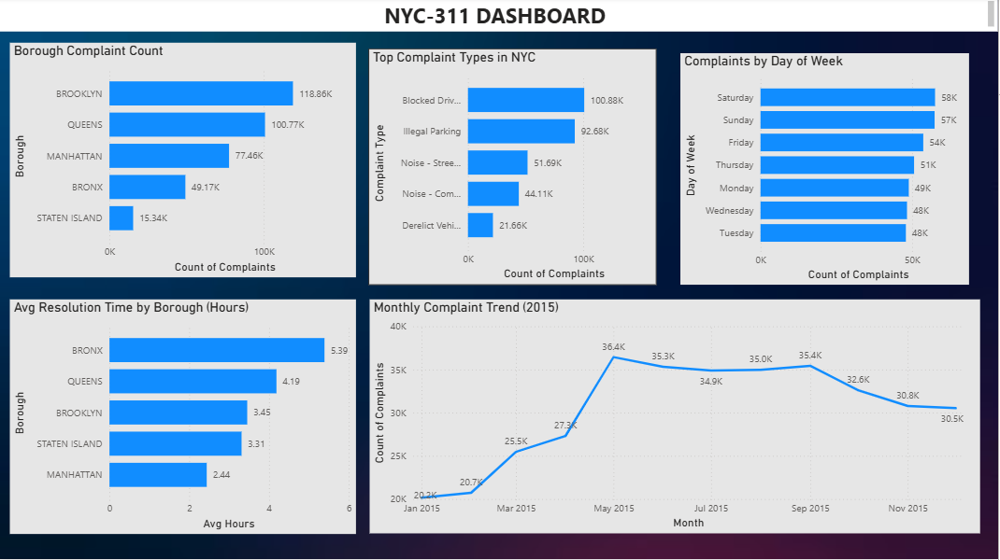

# NYC311-Service-Requests-Analysis
SQL data cleaning and analysis of 364K NYC 311 complaints with Power BI dashboard

## Project Overview
Analysis of 364,558 NYC 311 service requests using MySQL for data cleaning and analysis, and Power BI for visualization.

## Dashboard

## Dataset
- **Source:** Kaggle — pablomonleon/311-service-requests-nyc
- **Size:** 364,558 rows
- **Tool:** MySQL Workbench, Power BI

## What I Did
- Loaded 364K+ rows using LOAD DATA INFILE
- Cleaned messy data — NULL values, inconsistent formats, mixed date formats
- Converted two different date formats using STR_TO_DATE
- Wrote 8 business analysis queries
- Built 5-chart Power BI dashboard

## SQL Skills Used
- Data cleaning and NULL handling
- GROUP BY and aggregations
- TIMESTAMPDIFF for resolution time
- Window Functions (RANK, PARTITION BY)
- CTEs (Common Table Expressions)
- Date functions (STR_TO_DATE, DAYNAME, DATE_FORMAT)

## Key Findings
- Brooklyn has most complaints (118K) — 64% above city average
- Blocked Driveway is #1 complaint in 4 out of 5 boroughs
- Manhattan resolves complaints fastest (2.44 hrs)
- Bronx is slowest (5.39 hrs) — needs resource improvement
- Weekends (Sat/Sun) have highest complaint volume
- Complaints peak in May and decline through December

## Tools Used
- MySQL Workbench
- Power BI Desktop
- Kaggle
